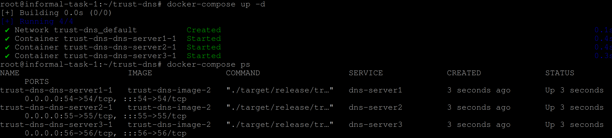
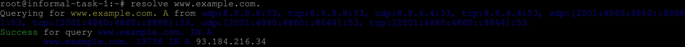

# Building the Cluster of DNS Servers

To create a cluster of DNS servers using Docker Compose, we will follow these steps:

1. Install Docker Compose:

Firstly, ensure that Docker Compose is installed on your system. If not, follow the installation instructions specific to your operating system. Docker Compose allows us to define and manage multi-container applications.

- Remove any previous versions of Docker Compose
```shell
sudo apt-get remove docker-compose
```
- Download the latest binary and place in `/usr/local/bin`
```shell
sudo curl -L "https://github.com/docker/compose/releases/latest/download/docker-compose-$(uname -s)-$(uname -m)" -o /usr/local/bin/docker-compose
```
- Apply executable permissions to downloaded binary
```shell
sudo chmod +x /usr/local/bin/docker-compose
```

2. Create a Docker Compose YAML file:

Next, create a YAML file (e.g., docker-compose.yml) to define the containers for your DNS server cluster. In this file, you will specify the configuration details for each container.

docker-compose.yml:
```yml
version: '2'
services:
  dns-server1:
    image: trust-dns-image
    ports:
      - 54:54

  dns-server2:
    image: trust-dns-image
    ports:
      - 55:55

  dns-server3:
    image: trust-dns-image
    ports:
      - 56:56
```

The above `yml` file defines each container, the image it uses and port number.  

3. Launch the DNS server cluster:

Navigate to the directory containing the docker-compose.yml file, and run the following command to launch the DNS server cluster in detached mode:
```shell
docker-compose up -d
```
4. Verify the running containers:

```shell
docker-compose ps
```


Now that the containers are setup on the default network your DNS cluster is complete.  To test the DNS server please use the following command to send a query.
```shell
resolve www.example.com.
```

If this command was successful you should see the following output.
```shell
Querying for www.example.com. A from udp:8.8.8.8:53, tcp:8.8.8.8:53, udp:8.8.4.4:53, tcp:8.8.4.4:53, udp:[2001:4860:4860::8888]:53, tcp:[2001:4860:4860::8888]:53, udp:[2001:4860:4860::8844]:53, tcp:[2001:4860:4860::8844]:53
Success for query www.example.com. IN A
        www.example.com. 19758 IN A 93.184.216.34
```

